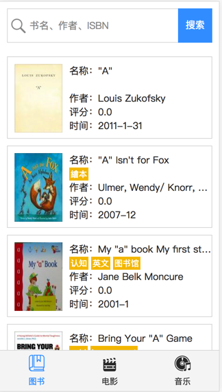
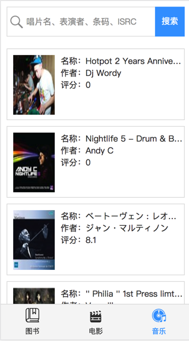
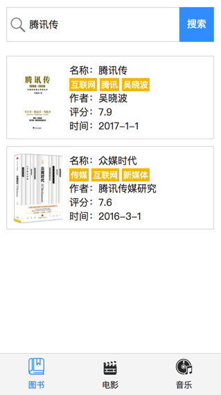
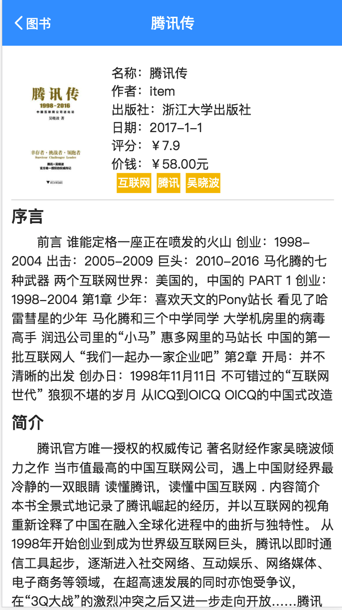
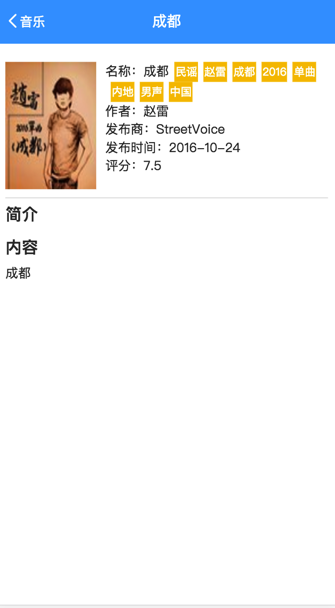

# 使用React开发口袋豆瓣

## 项目说明
本项目开发一个叫 ***口袋豆瓣*** 的应用，在豆瓣应用我们可以获取（或者搜索获取）到豆瓣的图书，电影，音乐列表以及相关的详情信息，具体效果图如下：

## 使用
- clone到本地后，使用`npm install`安装
- 安装后，使用`npm run dev`运行

## 具体要求

1. 使用 `React` + `ES6` 来开发项目。完成下面的功能：
    - 列表页展示
    - 底部 Tab 切换类别
    - 顶部搜索框功能
    - 点击 item 展示详情页
    - 返回列表页等功能。
    - 列表页实现**下拉刷新**以及**拉到底部加载更多**的功能

2. 拉取豆瓣上的数据：[豆瓣 API](https://developers.douban.com/wiki/?title=api_v2)
3. 管理代码规范：[standard](https://standardjs.com/)

## 1. 具体功能介绍
### 1.1 列表展示
共有三种不同类型的列表（图示-电影-音乐），每一个列表需要展示至少一页的内容。

图书列表：

电影列表：

音乐列表：

### 1.2 底部导航
底部常驻导航栏，点击可切换不同类型，控制列表展示相应的内容。

### 1.3 顶部搜索
顶部搜索框，输入内容点击搜索后，会在当前类别进行搜索出相关内容

### 1.4 内容详情
点击列表中的每一项可以进入内容详情，点击左上角可返回

图书详情：

电影详情：

音乐详情：

## 2. 通过JSONP 拉取豆瓣数据
使用豆瓣 API 接口，涉及到跨域问题，可通过 `JSONP` 方式解决。建议使用下面的 JSONP 拉取组件（React 体系中不建议 jQuery）：
- [fetch-jsonp](https://github.com/camsong/fetch-jsonp)

### 豆瓣接口说明
[豆瓣开发者网站](https://developers.douban.com/wiki/?title=guide)有许多接口的说明文档，需要根据看豆瓣文档中接口的数据格式说明来进行开发页面。本应用涉及的接口文档如下：

### 图书相关
- 拉取图书列表和搜索图书列表可使用下面的接口:

  https://developers.douban.com/wiki/?title=book_v2#get_book_search

### 音乐相关
- 拉取音乐列表和搜索音乐列表可使用下面的接口:

  https://developers.douban.com/wiki/?title=music_v2#get_music_search

### 电影相关
由于拉取电影列表接口有点特殊，涉及接口需要有两条：
- 【拉取电影 top 250 列表】

  https://developers.douban.com/wiki/?title=movie_v2#top250
- 【搜索电影】

  https://developers.douban.com/wiki/?title=movie_v2#search

**注意：豆瓣 API 有权限和访问次数限制，单个 ip 限制每个小时 150 次，这个问题可查看[这里](https://developers.douban.com/wiki/?title=api_v2)的说明。因此建议在开发时把拉取到的数据存到本地，避免超过次数。**

## Standard
为了更好的管理我们的代码，我们需要有相应的代码规范管理工具。这里需要大家学习使用 `Standard` 来管理 JavaScript 的代码规范。

- [Standard 文档](https://standardjs.com/)
- [Standard - github 仓库](https://github.com/standard/standard)

